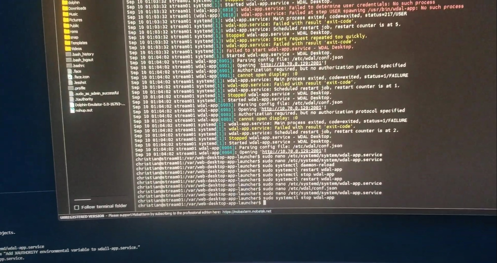
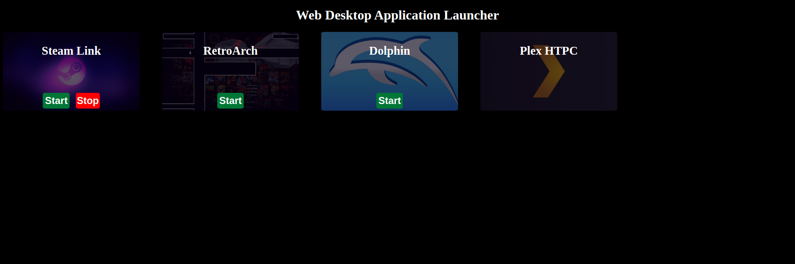

After purchasing a [mini-PC](https://www.amazon.com/dp/B0D5CS3CDS) that I planned to use for movie and game streaming along with emulation ([Dolphin](https://dolphin-emu.org/); Wii/GameCube), I found opening specific applications from the terminal was inconvenient. I wanted an application that allowed me to launch specific applications such as [Steam Link](https://store.steampowered.com/app/353380/Steam_Link/), [RetroArch](https://www.retroarch.com/), [Dolphin](https://dolphin-emu.org/), and [Plex HTPC](https://support.plex.tv/articles/htpc-getting-started/) from the desktop itself and through a website.

While I am sure there are applications that are already capable of achieving this, I wanted to make my own applications to gain more experience (specifically with C++ and GTK + WebKit2GTK).

**NOTE** - The website intentionally doesn't contain any security measures and runs commands under the user running the website. Do **not** expose this website to unauthorized users! I only recommend running it under your LAN and on a server that doesn't contain any sensitive data.

## Preview
### Video Demonstration
[](https://www.youtube.com/watch?v=0g1pquXcWic)
### Website


**NOTE** - I may improve the front-end web design in the future, but wanted to create something simple first.

## Technologies Used
### Desktop Application
I utilize [GTK 3](https://docs.gtk.org/gtk3/) and [WebKit2GTK](https://webkitgtk.org/) to create a desktop application through GNOME and display our web page.

### Web Application
I simply utilize Golang for running a web server with its template system for serving HTML content along with basic JavaScript and CSS.

## Building
I recommend using the [`Makefile`](./Makefile) via `make` to build this project. You will also need to build the [`nlohmann/json`](https://github.com/nlohmann/json) library which is used to parse our config file in the desktop application.

### Prerequisites
* Golang
* GTK 3 & WebKit2GTK (e.g. `libgtk-3-dev` and `libwebkit2gtk-4.0-dev` Ubuntu/Debian packages)
* [`nlohmann/json`](https://github.com/nlohmann/json)

For Ubuntu/Debian, I'd recommend the following command to install the required system packages.

```bash
sudo apt install -y libgtk-3-dev libwebkit2gtk-4.0-dev pkgconf build-essential make cmake golang-go
```

### Cloning
Clone the repository recursively so that the JSON sub-module is also cloned.

```bash
# Clone the repository
git clone --recursive https://github.com/gamemann/web-desktop-app-launcher.git /var/web-desktop-app-launcher

# Change directories.
cd /var/web-desktop-app-launcher
```

**NOTE** - The reason I clone into `/var/` is because that is the directory the [`systemd`](./systemd/) services use as the working directory. You may change this if you'd like of course.

### Desktop Application
#### Building The JSON Library
You will need to build the [`nlohmann/json`](https://github.com/nlohmann/json) before building the main desktop application. You can use `make json` or the following shell commands.

```bash
# Change to JSON library.
cd src/desktop/modules/json

# Create build directory and change to it.
mkdir build

cd build/

# Use CMake.
cmake ..

# Install library to system.
cmake --build . --target install
```

Afterwards, you may use `make` and `make install` (as root) to build and install the desktop and web applications.

## Command Line
At this time, both the web and desktop applications use the same command-line options which are listed below.

| Flag(s) | Default | Description |
| ----- | ------- | ----------- |
| `-c --cfgflag` | `/etc/wdal/conf.json` | The path to the config file. |
| `-l --list` | N/A | Prints the config settings. |
| `-v --version` | N/A | Prints the current version. |
| `-h --help` | N/A | Prints the help menu. |

## Configuration
Both the desktop and web applications parse a single JSON config file (the default path is `/etc/wdal/conf.json`). In both applications, you can also change the config path via the `-c` and `--cfgpath` command-line flags (e.g. `-c ./conf.json`).

| Key | Type | Default | Description |
| --- | ---- | ------- | ----------- |
| desktop | Desktop Object | `{}` | The desktop object (read below). |
| web | Web Object | `{}` | The web object (read below). |
| applications | Application Object Array | `[]` | The applications object array (read below). |

<details>
    <summary>Example(s)</summary>

```json
{
    "desktop": {
        ...
    },
    "web": {
        ...
    },
    "apps": [
        ...
    ]
}
```
</details>

### Desktop Object
The desktop object contains information on the desktop settings.

| Key | Type | Default | Description |
| --- | ---- | ------- | ----------- |
| window_width | int | `1920` | The desktop window width (useless with full-screen mode). |
| window_height | int | `1080` | The desktop window height (useless with full-screen mode). |
| full_screen | bool | `true` | Whether to use full-screen mode for the desktop application. |

<details>
    <summary>Example(s)</summary>

```json
{
    "window_width": 1200,
    "window_height": 720,
    "full_screen": false
}
```
</details>

### Web Object
The web object contains information on the web settings.

| Key | Type | Default | Description |
| --- | ---- | ------- | ----------- |
| host | string | `127.0.0.1` | The web host/address to bind with. |
| port | int | `2201` | The web port to bind with. |
| log_to_file | bool | `true` | Logs `stdout` and `stderr` pipes from processes launched to `log_directory/apps`. |
| log_directory | string | `logs/web` | The directory to log to. |
| env | Object | `{}` | A string to string object that represents environmental variables that should be set before launching every application. |

<details>
    <summary>Example(s)</summary>

```json
{
    "host": "192.168.1.5",
    "port": 80,
    "env": {
        "GLOBAL_ENV1": "VAL1",
        "GLOBAL_ENV2": "VAL2"
    }
}
```
</details>

### Application Object
| Key | Type | Default | Description |
| --- | ---- | ------- | ----------- |
| name | string | `NULL` | The name of the application (for display). |
| start | string | `NULL` | The command to execute when starting the application. |
| stop | string | `NULL` | The command to execute when stopping the application. |
| banner | string | `NULL` | The banner to use inside of the web-view card. |
| env | Object | `{}` | A string to string object that represents environmental variables (key => value). |

<details>
    <summary>Example(s)</summary>

```json
[
    {
        "name": "Steam Link",
        "start": "flatpak run com.valvesoftware.SteamLink",
        "stop": "pkill steamlink",
        "banner": "/images/steam.jpg"
    },
    {
        "name": "RetroArch",
        "start": "retroarch",
        "stop": "pkill retroarch",
        "banner": "/images/retroarch.png"
    },
    {
        "name": "Dolphin",
        "start": "dolphin-emu",
        "stop": "pkill dolphin-emu",
        "banner": "/images/dolphin.jpg"
    },
    {
        "name": "Plex HTPC",
        "start": "flatpak run tv.plex.PlexHTPC",
        "stop": "pkill plex-bin",
        "banner": "/images/plex.png"
    }
]
```
</details>

## Notes
### Launching GUI Applications From WDAL On Debian 12
There were a couple of things I needed to do in order to get applications to launch from WDAL.

1. The command `xhost +LOCAL:` (or `xhost +SI:localuser:$(whoami)`) needs to be executed. Executing this command doesn't save on reboot, but for most Linux distros you can put this command inside your `$HOME/.bashrc` file so it saves on reboot.
2. The `DISPLAY` (usually `:0`) and `XAUTHORITY` (usually `$HOME/.Xauthority`) environmental variables need to be set inside of the config for all apps.

This is likely the case for other Linux distros also. There's a chance on other distros like Ubuntu that it has a different desktop manager (e.g. GDM) and the `.Xauthority` file is somewhere else.

For my Debian 12 installation that has autologin enabled (and keyring disabled), placing the `xhost` command inside of the `$HOME/.bashrc`, `$HOME/.xinitrc`, `$HOME/.xprofile`, `/etc/profile`, and `/etc/X11/Xsession.d/60xhost` files did not work on reboot along with a `systemd` service. Therefore, I needed to create a desktop autostart file in `$HOME/.config/autostart/xhost.desktop` with the following contents (you may need to create the `$HOME/.config/autostart` directory).

```bash
[Desktop Entry]
Type=Application
Exec=bash -c "sleep 5 && DISPLAY=:0 xhost +LOCAL:"
X-GNOME-Autostart-enabled=true
```

## Credits
* [Christian Deacon](https://github.com/gamemann)